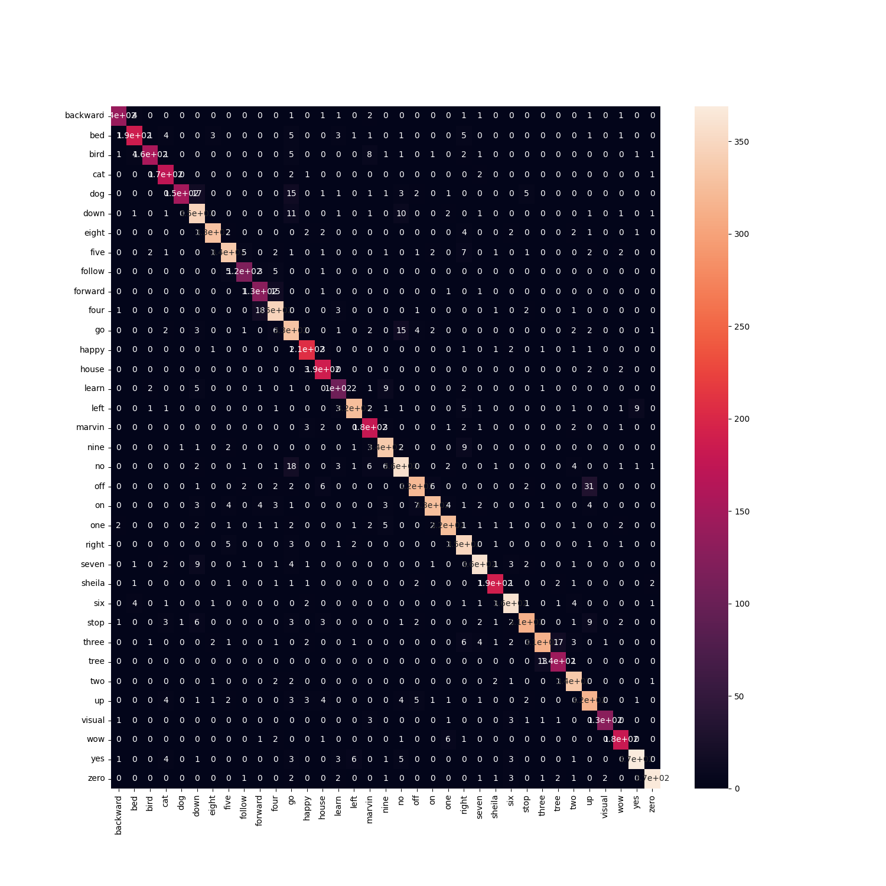

# Description

Fine-tune ResNet variants on the speech commands dataset.
The ``params.yaml`` config file constains parameters to 
train with MFCC features using ResNext50 as the backbone.

[Download the checkpoints from here](https://mega.nz/file/0ekWGYqB#JdX9q5U1L87bxwwe3fzdkgz_bg0ppa3stboLBLAzb2Q) 
and extract to the root of the repo with:

``tar -xzvf lightning_logs.tgz``

This configuration achieves ~91.5% accuracy on the test set.

The best checkpoint I've produced so far is:

``lightning_logs/version_1/checkpoints/kws-res-epoch10-val_acc0.92.ckpt``

Not all training runs are the same, sometimes re-running will
give slightly better / worse performance.

The metrics reported at the very end of train are not for the
best checkpoint. Once training is done, to get the metrics
for the best checkpoint - please follow the steps under the
``Evaluation`` section.

Created by Sebastian Parkitny Dec 2022.

# Requirements

At minimum a machine with CUDA 11.x installed on the system.

# Installation

Run:

```bash
conda env create -f environment.yaml
conda activate kws
```

the first run of ``train`` and ``eval`` commands will download
the speech commands dataset, it'll re-use the data for subsequent
runs.

# Training


Run:

```python
python -m src.train
```

NOTE: You'll need ~8GB VRAM to run with this config, if you run out of memory,
try lowering ``batch_size`` in ``params.yaml``.

Metrics reported at the end of train are for the last checkpoint and not the best
checkpoint, see the Evaluation section for steps on evaluating the best checkpoint.

# Evaluation

Run:

```python
python -m src.eval
```

By default, this will find the checkpoint with best ``val_acc`` in the last version in
``lightning_logs``. For the zipped version of this project, it will use this checkpoint: 
``lightning_logs/version_1/checkpoints/kws-res-epoch10-val_acc0.92.ckpt``

You should see output similar to this:

```
┏━━━━━━━━━━━━━━━━━━━━━━━━━━━┳━━━━━━━━━━━━━━━━━━━━━━━━━━━┓
┃        Test metric        ┃       DataLoader 0        ┃
┡━━━━━━━━━━━━━━━━━━━━━━━━━━━╇━━━━━━━━━━━━━━━━━━━━━━━━━━━┩
│         test_acc          │    0.9154393076896667     │
│      test_loss_epoch      │    0.31753432750701904    │
└───────────────────────────┴───────────────────────────┘
```

Alternatively, use the ``-c`` argument to specify a path to another checkpoint.

NOTE: If the train command was run before eval, it will use what ever the best
saved checkpoint was for the last training run. To see metrics for my best 
checkpoint, please manually specify the path with ``-c``.

i.e.

``src.eval -c lightning_logs/version_1/checkpoints/kws-res-epoch10-val_acc0.92.ckpt``

### Confusion Matrix for the above checkpoint:
[](./confmat.png)

# Visualisation

Run: 

```python
PYTHONPATH=`pwd` jupyter-notebook exploration/
```

Then open the data-exploration notebook. Run each cell one at a time.
Alternatively, the output is in exploration/data-exploration.html

# Model Analysis

Run: 

```python
PYTHONPATH=`pwd` jupyter-notebook exploration/
```

Then open the model-analysis notebook. Run each cell one at a time.
Alternatively, the output is in exploration/model-analysis.html

# Additional Info

The min and max values of the MFCC spectrograms for the training set
are calculated by running:

```python
python -m src.data
```

These were computed once then added into ``params.yaml`` for use during
training.
